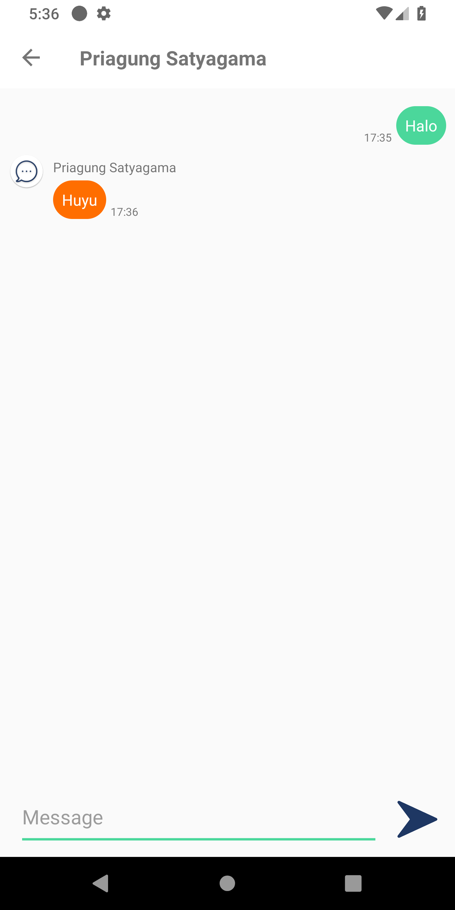
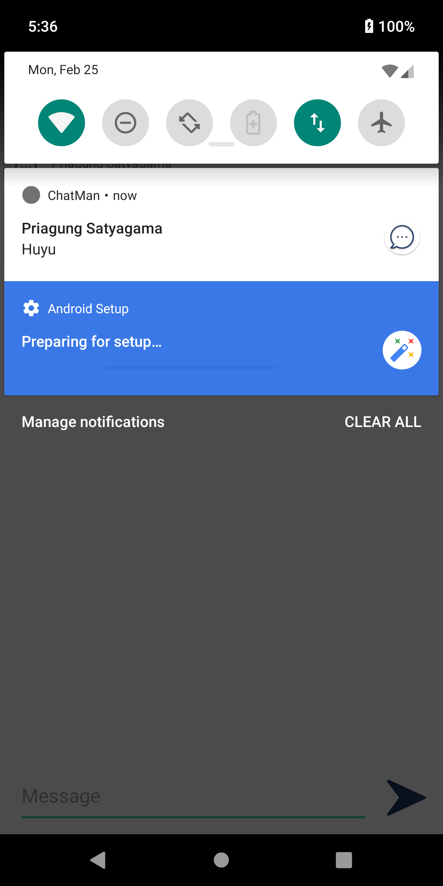
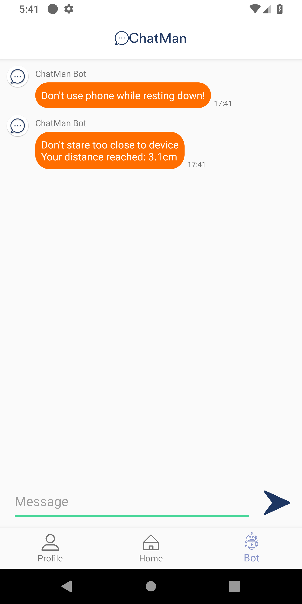
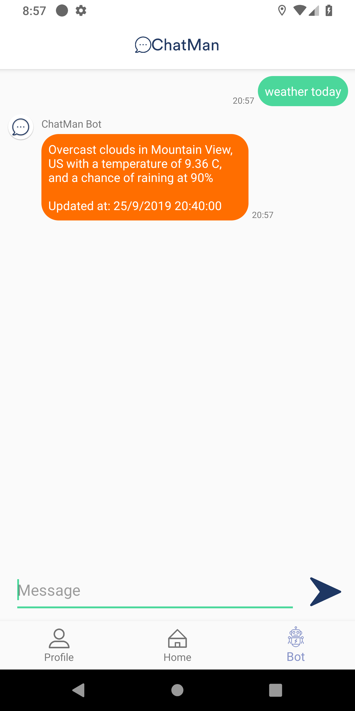
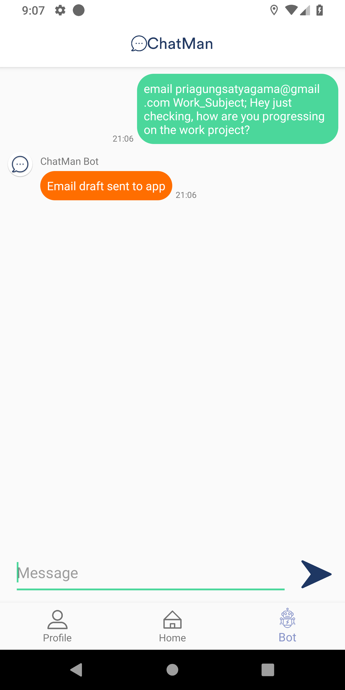

# ChatMan

<p align="center">  </p>

## About

ChatMan is a chat messaging app with built-in multi purpose chatbot providing various features to the users, from daily weather to general-purpose compass, and many more.


Built for ITB-IF3111 class assignment.  

## Display
<p align="center">    </p>  

## How to Install
1. Export  `ChatMan.apk` to an Android device.

2. Install the apk

3. (Optional) To enable push notification, start the backend server by executing at directory `backend/`
```
npm install && node app.js
```

4. Run the app

## Features

### Chat
Realtime messaging with another ChatMan user

<p align="center">   </p>

### Detection Service
Detect and remind you when you are too close to the screen and using face down

<p align="center"> 

### Weather Today
Get up-to-date weather information on your location in meaningful and understandable format

<p align="center"> 

### Compass
Never lost your heading by using accurate compass built-in with ChatMan

<p align="center"> 

### Send Email
Quickly jump to your preferred email app pre-written through your chat to ChatMan

<p align="center"> 

## Technology
- Written for [Android](https://www.android.com) platform with [Java](https://www.java.com/) and [XML](https://www.w3.org/XML/)
- Database, messaging, and push notification powered by [Google Firebase](https://firebase.google.com)
- Push notification backend made with [Node.js](https://nodejs.org)
- Weather API provided by [OpenWeatherMap](https://openweathermap.org)

## Authors
Yusuf Rahmat Pratama - *Developer*<br>
Priagung Satyagama - *Developer*<br>
Ilham Firdausi Putra - *Developer*

